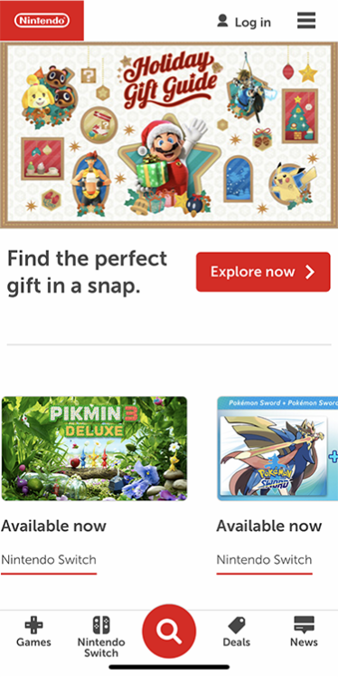
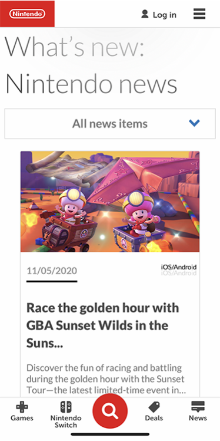

# Procesverslag
**Auteur:** Kathleen van Dam

Markdown cheat cheet: [Hulp bij het schrijven van Markdown](https://github.com/adam-p/markdown-here/wiki/Markdown-Cheatsheet). Nb. de standaardstructuur en de spartaanse opmaak zijn helemaal prima. Het gaat om de inhoud van je procesverslag. Besteedt de tijd voor pracht en praal aan je website.

## Bronnenlijst
1. https://flexbox.io
2. https://css-tricks.com/snippets/css/a-guide-to-flexbox/
3. -...-

## Eindgesprek (week 7/8)

-dit ging goed & dit was lastig-

**Screenshot(s):**

-screenshot(s) van je eindresultaat-

## Voortgang 3 (week 6)

**Ging goed**
- Eerlijk gezegd krijg ik momenteel niks goed. Het enige wat momenteel goed is is dat ik zin heb om alles op te lossen en ermee aan de slag te gaan om het wel goed te krijgen. 
- Het was wel gelukt een media query erin te krijgen bij het grid dus dat staat nu gelijk aan de website van nintendo. 
- Bij de les vorige week hebben we aan de hand van borders nu lijnen toegevoegd aan de website waardoor er onderscheid is tussen de verschillende secties. 
- Na het voortgangsgesprek zijn de images van trending games gefixt en schalen ook de overlay images van het grid mee. 

**Ging fout**
- 1 ding dat niet zo goed gaat is het grid. Ik wil de overlay img goed krijgen want deze schaalt niet goed mee. 
- De banner img en 1e img van trending games zijn hetzelfde waardoor ik allebei de images beinvloed wanneer ik een width wil zetten. Nou wil ik dit alleen op de trending games doen en niet op de banner, maar dit is me nog niet bepaald gelukt. Ook probeer ik uit te zoeken hoe de afbeeldingen van trending games niet te ver meeschalen aangezien die maar een bepaalde max-width behouden. 

**Screenshot(s):**

-screenshot(s) van hoe ver je bent met

- Media queries toegevoegd waardoor het grid nu naast elkaar komt te staan zodra de website breder wordt. 

### Agenda voor meeting

-samen met je groepje opstellen-

| Ruben          | Jordi              | Marijn       | Kathleen         |
| ---            | ---                | ---          | ---              |
|                |                    |              | Overylay img   |

## Screen reader opdracht
- Ik kwam er achter dat mijn hele website niet eens werkt met een screenreader. Wanneer hij het menu van de browser en de tabbladen is afggegaan begint hij gewoon weer opnieuw. Het enige wat hij doet is aangeven wat voor website het is, maar hij pakt niet de elementen zoals het logo en de navigatie of headers. Ik weet niet goed waardoor dit komt maar het moet wel aangepast worden. 

## Voortgang 2 (week 5)

**Ging goed**
- Na even wat proberen en een beetje hulp was ik onwijs blij hoe mijn foto's meeschaalde als ik mijn website vergrootte en verkleinde. Hierdoor heb ik meteen al mijn afbeeldingen er in kunnen zetten en ziet de site er een stuk netter uit. Ik merk dat ik het leuk vind om alles responsive te maken en om te werken met grid. 

**Ging fout**
- Ik heb nog steeds last met het uitlijnen van elementen. Ik weet niet zo goed hoe het komt dat ik overal ruimte overhoud als ik nergens een padding of margin op heb zitten. 
- Ik had in de eerste instantie moeite met SVG's omdat ik hiervan de code zelf in mijn HTML wilde zetten alleen sommige images waren enorm waardoor dit niet kon. Hierna heb ik gewoon de link gebruikt en de width in css op 100% gezet. 

**Screenshot(s):**

-screenshot(s) van hoe ver je bent met

-Ik heb al mijn afbeeldingen responsive gemaakt en nieuwe afbeeldingen toegevoegd waardoor alles er completer uitziet. Ook heb ik wat aanpassingen gemaakt in mijn grid bij de characters waardoor de tekst nu mooi mee schaalt. 

### Agenda voor meeting

-samen met je groepje opstellen-

| Ruben          | Jordi              | Marijn       | Kathleen         |
| ---            | ---                | ---          | ---              |
| Grid           | Hele website is aangepast | Uitlijning            | Overige ruimte   |

## Voortgang 1 (week 3)

### Stand van zaken

**Ging goed**
- Na wat hulp gevraagd te hebben kwam ik goed op gang en vooral position en flexbox vond ik interessant om mee te werken. Wanneer ik dit een beetje onder controle had voelde het alsof ik al zoveel verder kon met het namaken van de website.

**Ging fout**
- Waar ik op vast liep is om eigenlijk de oude stof ook toe te blijven passen. Wanneer we iets nieuws geleerd hebben vergeet ik alles wat ervoor kwam en kom ik er niet uit hoe ik iets in mijn css werkende krijg. Vooral uitlijnen is ook iets waar ik moeite mee had.

**Screenshot(s):**

-screenshot(s) van hoe ver je bent met

-Ik heb het menu toegevoegd en sticky gemaakt. Er is een banner toegevoegd met de tekst en een button. Er zijn want afbeeldingen toegevoegd en de bijbehorende tekst staat er allemaal in. Sommige delen hebben nog wat opmaak nodig.

### Agenda voor meeting

-samen met je groepje opstellen-

| Ruben          | Jordi              | Marijn       | Kathleen         |
| ---            | ---                | ---          | ---              |
| Responsive     | Slider             | Uitlijning & afbeeldingen   | Uitlijning       |

### Verslag van meeting

-na afloop snel uitkomsten vastleggen-
We merken dat het allemaal kleine dingen zijn waar we vastlopen. Hierbij zouden we goed elkaar kunnen helpen of makkelijk hulp vragen.

## Breakdownschets (week 1)

-uitwerken voor de 1e werkgroep - eind van de eerste week-

## Intake (week 1)
-uitwerken voor de kick-off werkgroep - begin van de eerste week-

**Je startniveau:** Rood

**Je focus:** surface plane

**Je opdracht:** https://www.nintendo.com

**Screenshot(s) van de eerste pagina (small screen):**

**Screenshot(s) van de tweede pagina (small screen):**

